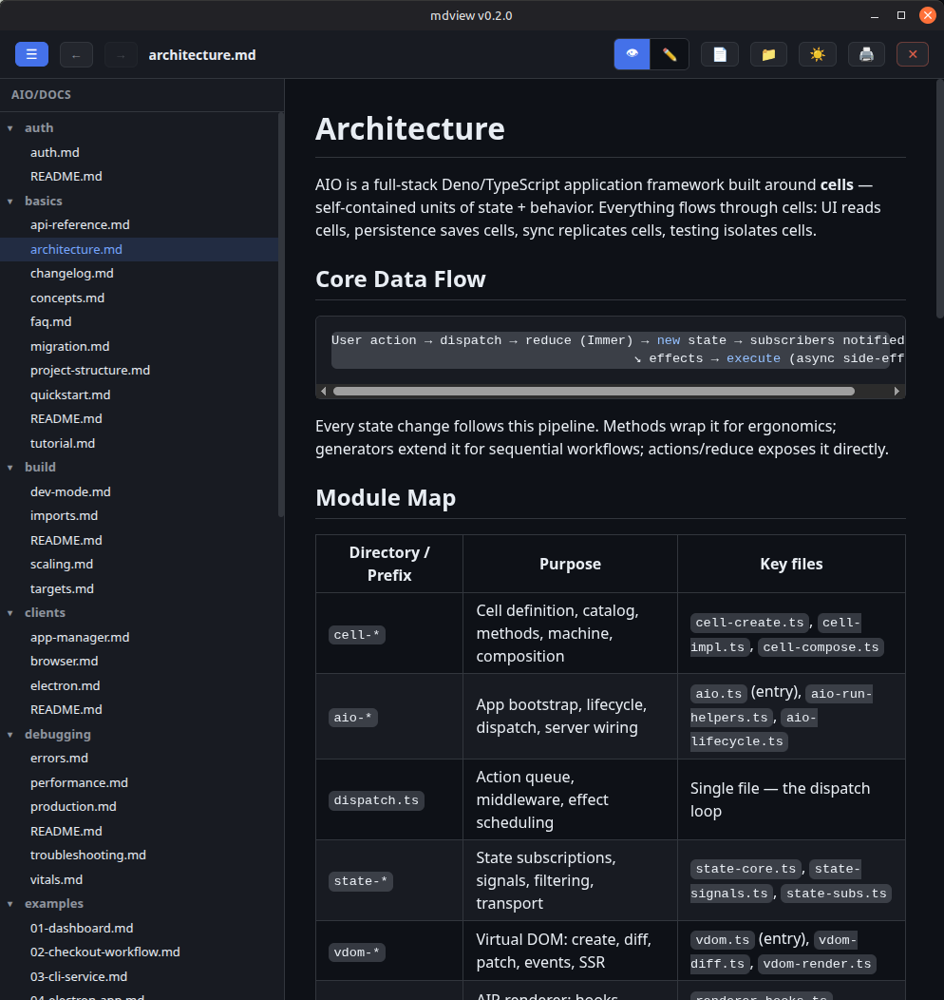

# mdview

Desktop markdown **viewer + editor** with a workspace sidebar, document outline, cross-file search, remote-file support, syntax highlighting, zoom, and dark/light themes.

Built with Deno + Electron on the [aio](https://github.com/riagentic/aio) framework (AIR signal-based renderer).



## Usage

```sh
# open a file directly
mdview README.md

# open a folder as a workspace (sidebar file tree)
mdview ./docs

# or launch and use the native file/folder picker
mdview
```

## Keyboard shortcuts

| Shortcut | Action |
|---|---|
| Ctrl+O | Open file (native dialog) |
| Ctrl+B | Toggle workspace sidebar |
| Ctrl+E | Toggle view / edit mode |
| Alt+← / Alt+→ | Navigate back / forward |
| Ctrl+F | Search text |
| Enter / Shift+Enter | Next / previous match |
| Esc | Close search |
| Ctrl++ / Ctrl+- | Zoom in / out |
| Ctrl+0 | Reset zoom |
| Ctrl+Scroll | Zoom in / out |
| Ctrl+W | Close document |

Print and theme toggle (🌙/☀️) are on the toolbar.

## Features

- **Workspace sidebar** — folder file tree with create / rename / delete (inline UI); resizable, persisted width
- **Cross-file search** — search `.md` content across the whole workspace from the sidebar, jump to any hit
- **Document outline** — resizable table-of-contents panel; click a heading to jump
- **Remote & external links** — open a remote `.md` in-app (fetched & rendered), web pages in the system browser; link markers show the destination (↗ web, ⤓ remote md, ✉ mail)
- **Inline editor** — markdown syntax highlighting, debounced autosave, external-change detection & reload
- **Navigation** — clickable relative links between docs, in-document anchors, back/forward history with scroll restoration
- **Dark / light theme** — toggle on the toolbar, persisted across sessions
- GFM (GitHub Flavored Markdown) rendering, sanitized (DOMPurify); YAML frontmatter hidden from the view
- Syntax highlighting with auto-detection, one-click **copy** on every code block
- In-document text search with match navigation
- Zoom (25% – 300%) via keyboard and mouse wheel
- Session persistence — reopens last document/workspace, scroll position, zoom, theme, and sidebar state
- Native OS file/folder dialog (zenity / kdialog)
- Window position/size persistence and print support

## Development

```sh
# run in dev mode (hot reload)
deno task dev

# run the test suite
deno task test

# app manager — status, state inspection, dispatch, UI snapshot
deno task am status

# compile to standalone binary / Electron app
deno task compile
deno task compile:electron
```

## Stack

- Deno 2.6+ / TypeScript / Electron
- [aio](https://github.com/riagentic/aio) `1.0.0-beta1` — AIR renderer, state management, persistence
- [marked](https://github.com/markedjs/marked) — markdown parsing
- [highlight.js](https://highlightjs.org/) — syntax highlighting
- [isomorphic-dompurify](https://github.com/kkomelin/isomorphic-dompurify) — HTML sanitization
